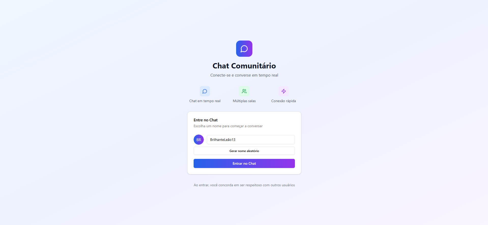
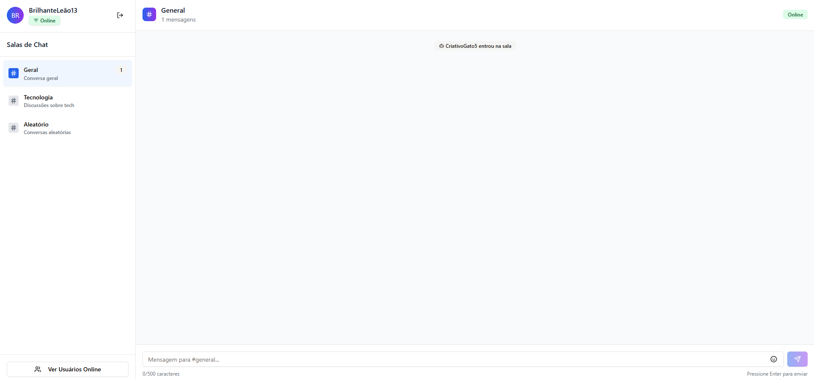
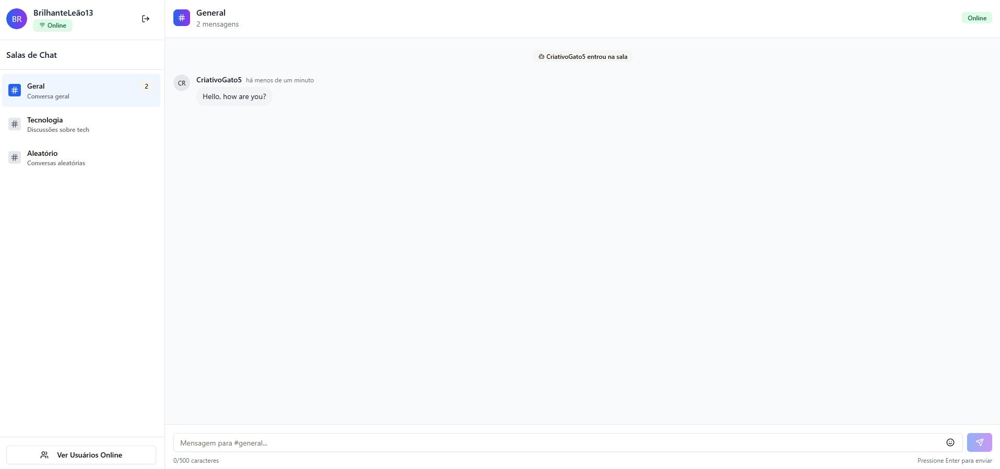
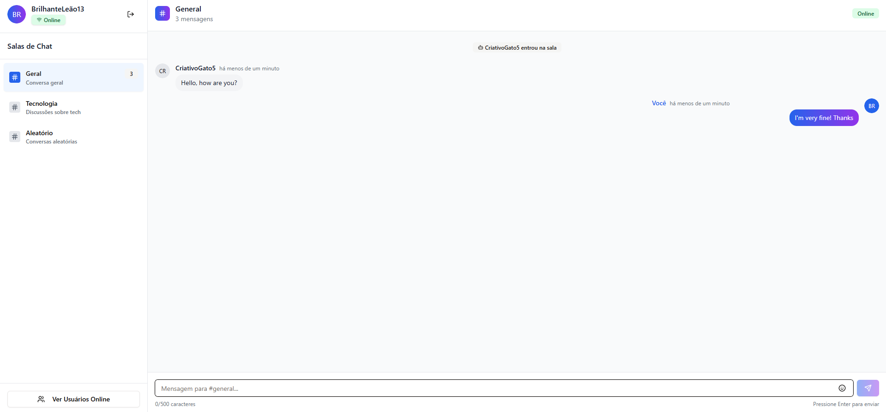

# 💬 Chat Comunitário com SignalR

Uma aplicação de chat em tempo real desenvolvida com **ASP.NET Core + SignalR** no backend e **Next.js (React)** no frontend. Permite múltiplas salas, conexão automática, feedback visual de conexão e troca de mensagens em tempo real.

## 🚀 Tecnologias Utilizadas

### 🧠 Backend (.NET)
- ASP.NET Core 9
- SignalR
- CORS liberado para testes locais
- Singleton `ChatService` (opcional para futura persistência ou controle de mensagens)
- Endpoints:
  - `SendMessage(user, message, room)`
  - `JoinRoom(room, user)`
  - `LeaveRoom(room)`

### 💻 Frontend (Next.js + TypeScript)
- React 18 com app router (`"use client"`)
- TailwindCSS
- Context API (`ChatContext`)
- WebSocket automático via SignalR
- Toaster de feedback com hook customizado
- Componentes com UI desacoplada (LoginForm, ChatInterface, etc)

---
## ✨ Veja como ele funciona!

# Tela de Login



# Dashboard Principal




# Mensagem recebida



# Mensagem enviada




## ✨ Funcionalidades

- ✅ Login com nome aleatório ou personalizado
- ✅ Três salas padrão: Geral, Tecnologia, Aleatório
- ✅ Mensagens com distinção visual (próprias x de outros)
- ✅ Detecção de conexão/perda/reconexão em tempo real
- ✅ Mensagens de sistema: entrada/saída de usuários
- ✅ Integração SignalR 100% funcional com reconexão automática

---

## 🛠️ Como rodar o projeto localmente

### Pré-requisitos

- [.NET SDK 8+](https://dotnet.microsoft.com/)
- [Node.js 18+](https://nodejs.org/)
- [Yarn](https://yarnpkg.com/) ou npm

---

### Backend (ASP.NET Core)

```bash
cd backend
dotnet restore
dotnet run
